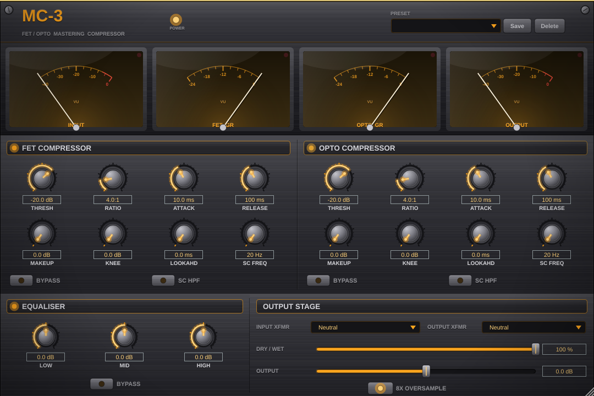

# MC-3 — FET & Opto Mastering Compressor

A professional mastering-grade audio plugin (VST3 + Standalone) pairing a **FET**
and an **Opto** compressor in series, with a 3-band EQ, selectable input/output
transformer models, 8× oversampling, and a vintage analogue-hardware interface.



## Features

- **Dual compressors in series** — a fast, aggressive **FET** stage and a smooth,
  musical **Opto** stage, each with independent Threshold, Ratio, Attack, Release
  and Makeup gain.
- **Per-compressor sculpting** — soft **Knee** (0–12 dB), **Lookahead** (0–50 ms),
  and a **sidechain high-pass** filter so low end doesn't pump the mix.
- **3-band EQ** — low shelf (200 Hz), mid bell (2 kHz), high shelf (8 kHz), ±12 dB.
- **Transformer modelling** — Bright / Neutral / Warm characters, selectable
  independently for input and output.
- **8× oversampling** — optional, for clean, alias-free transient handling.
- **Parallel compression** — global Dry/Wet mix.
- **Metering** — backlit analogue **VU meters** with swinging needles, peak-hold,
  scale numbers and glass reflections, for input/output level and per-compressor
  gain reduction.
- **Presets** — 7 factory presets plus save/load of your own.
- **Resizable UI** — aspect-locked, scales 65–150 %.

## Downloads

Pre-built **Windows** and **Linux** binaries (VST3 + Standalone) are attached to
each [release](../../releases). Every push is also built in CI, with artifacts on
the [Actions runs](../../actions).

Install the VST3 by copying `MC-3 FET and Opto Mastering Compressor.vst3` into:

| OS | VST3 folder |
|----|-------------|
| Windows | `C:\Program Files\Common Files\VST3` |
| Linux | `~/.vst3` |

## Building from source

### Requirements
- CMake 3.21+
- A C++17 compiler: **MSVC** on Windows, GCC/Clang on Linux, Apple Clang on macOS
- JUCE 8.0.13 (fetched into `./JUCE`)

JUCE is not vendored. Clone it next to the sources first (the `CMakeLists.txt`
does `add_subdirectory(JUCE)`):

```bash
git clone --depth 1 --branch 8.0.13 https://github.com/juce-framework/JUCE.git
cmake -B build -DCMAKE_BUILD_TYPE=Release
cmake --build build --config Release \
  --target MC3MasteringCompressor_VST3 MC3MasteringCompressor_Standalone
```

Artifacts land in `build/MC3MasteringCompressor_artefacts/Release/`.

On Linux, install the JUCE dependencies first:

```bash
sudo apt-get install -y libasound2-dev libxinerama-dev libxrandr-dev \
  libxcursor-dev libxcomposite-dev libfreetype6-dev libfontconfig1-dev \
  libcurl4-openssl-dev
```

> **Windows note:** JUCE does not support MinGW (there's a hard `#error` in
> `juce_core/system/juce_TargetPlatform.h`), so a Windows build **cannot** be
> cross-compiled from Linux — use MSVC, or let the CI workflow build it.

## Releasing

Push a version tag and CI builds all platforms and publishes a GitHub Release
with the binaries attached:

```bash
git tag v1.0.0
git push origin v1.0.0
```

## Project structure

```
src/
├── PluginProcessor.*          # Plugin processor: signal chain + parameter plumbing
├── PluginEditor.*             # Editor window (resizable, aspect-locked)
├── dsp/
│   ├── CompressorProcessor.*  # FET/Opto compressor (knee, lookahead, dry/wet)
│   ├── SidechainFilter.*      # Detector high-pass filter
│   ├── EQProcessor.*          # 3-band EQ
│   ├── TransformerSimulation.*# Transformer colour models
│   ├── Oversampler.*          # 8× oversampling
│   └── LevelMeter.*           # Lock-free metering
├── ui/
│   ├── MC3LookAndFeel.*       # Vintage hardware look (knobs, switches, metal)
│   ├── LabeledKnob.h          # Rotary + engraved caption + APVTS binding
│   ├── MeterComponent.*       # Analogue VU meters
│   ├── MainComponent.*        # Faceplate layout + header
│   ├── CompressorPanel.*  EQPanel.*  ControlsPanel.*  PresetPanel.*
└── utils/
    ├── Parameters.*           # APVTS parameter layout
    ├── ParameterSmoothing.h   # Click-free parameter ramps
    ├── PresetManager.*        # Save/load + factory presets
    └── Utilities.h            # dB/linear helpers
```
